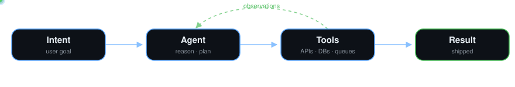

### 🤖 Backend Developer · AI Agents @ **Trinetra Labs** · since May 2026

I spent two years at PearlThoughts building the boring-but-critical stuff — data pipelines, APIs, SEO infra, distributed backends. Now I build **AI agents**: LLM-powered systems with real tools, real state, and real consequences — most recently, **scalable WhatsApp chatbots** running in production. Turns out clean architecture matters even more when your caller is a language model.

> *An agent is only as good as the systems it stands on.*

## ⚡ How my day looks

## 🛠️ Tech Stack

**Agentic & AI**

**Core (Production Experience)**

**Data & Infrastructure**

<b>Also worked with / exploring</b>

 

## 🔨 Things I've Actually Built

| Project | What makes it interesting |
|---|---|
| **[PrivacyBlur](https://github.com/TosmimForidMehtab/PriBlur)**   `Chrome Extension · Canvas API` | Most blur tools edit screenshots *after* the fact. This one blurs **during live screen capture** — real-time canvas overlay on a live stream, with circles, rectangles, freehand & eraser composited on the fly. |
| **[Shawtyfied](https://github.com/TosmimForidMehtab/Shawtify)**   `URL Shortener · SpringBoot · Kafka · Redis` | Production-grade: Snowflake ID + Base62 for coordination-free short codes, Redis rate limiting, Kafka async analytics, stateless JWT — plus a context-aware AI chat to query URL insights. |
| **[Conscious](https://github.com/TosmimForidMehtab/Conscious-API)**   `Journaling App · MERN` | The app gets out of your way: daily prompts arrive by email and entries are submitted **directly from the email** — zero-login journaling, with an OAuth dashboard for reviewing past entries. |
| **[Devs Blog](https://github.com/TosmimForidMehtab/DevBlog)**   `Blog Platform · MERN` | Full-stack platform with Google OAuth + email auth, Redux Toolkit state, and dark/light theming. |

<b>🧪 Side quests</b>

 

- 🦀 **Telegram Media Downloader** *(Rust)* — CLI tool to download media from Telegram
- 🐍 **File Organizer** *(Python)* — automates file sorting by type/date
- 🎮 **Games & Visualizers** *(C++ / SDL2)* — game projects built from scratch
- ⚡ **FastAPI & Django backends** *(Python)* — REST API experiments
- 🐹 **Go** — learning in progress, repos on GitHub

## 📊 GitHub Stats

**🏠 Personal — [@TosmimForidMehtab](https://github.com/TosmimForidMehtab)**

**💼 Work — [@tritosmim](https://github.com/tritosmim) · Trinetra Labs**

## 📬 Find Me

